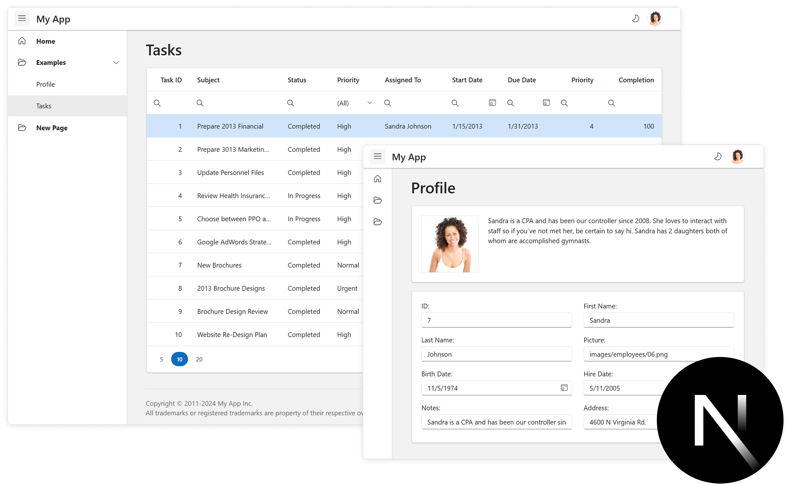

# DevExtreme React Next.js Template

The DevExtreme Next.js Template is a React application with a navigation menu and sample views in a responsive layout. This application is created with [create-next-app](https://nextjs.org/docs/app/api-reference/cli/create-next-app) and uses [DevExtreme React components](https://js.devexpress.com/Documentation/Guide/React_Components/DevExtreme_React_Components/).

## Getting Started

For more information about the DevExtreme React Next.js Template and how to customize it, refer to the following help topic: [Application Template](https://js.devexpress.com/Documentation/Guide/React_Components/Application_Template/).

## License

**DevExtreme React Next.js Template is released as a MIT-licensed (free and open-source) add-on to DevExtreme.**

- [DevExtreme License](https://js.devexpress.com/Licensing/)
- [Free trial](http://js.devexpress.com/Buy/)

## See Also

For DevExtreme React Template built with [Vite](https://vite.dev/guide/), refer to the following repository: [DevExtreme React Template](https://github.com/DevExpress/devextreme-react-template).